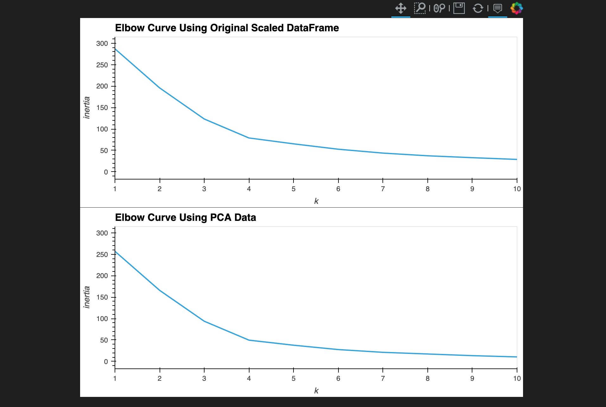
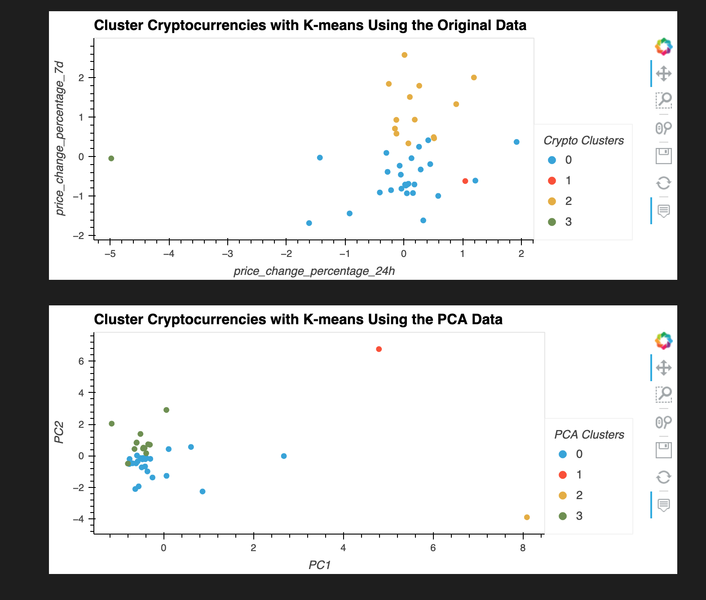

Challenge-19

I did this challenge by myself.

Visualize and Compare the Results:

Composite plot to contrast the Elbow curves:

Composite plot to contrast the clusters

Question:
After visually analyzing the cluster analysis results, what is the impact of using fewer features to cluster the data using K-Means?

Answer:
Using fewer features allows to visually see the values of the cluster easier on the chart, but still have a similar performance/output to the original.